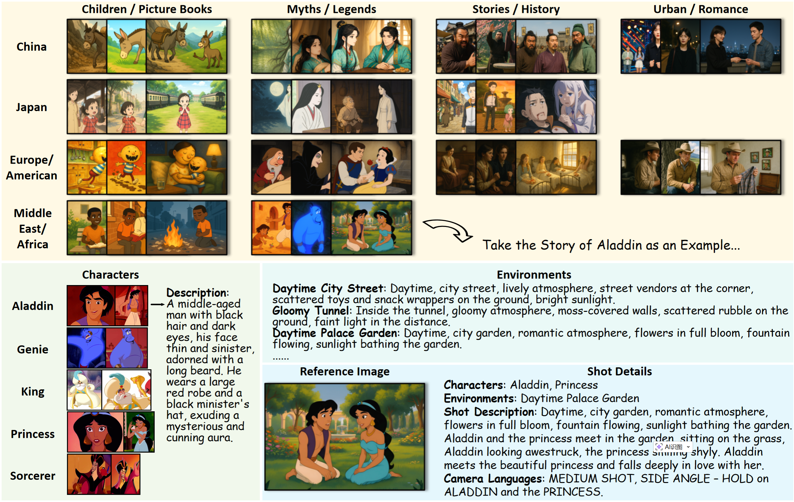
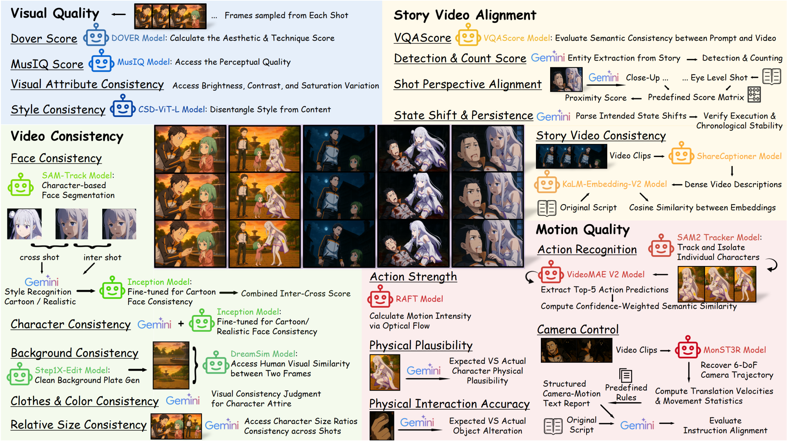
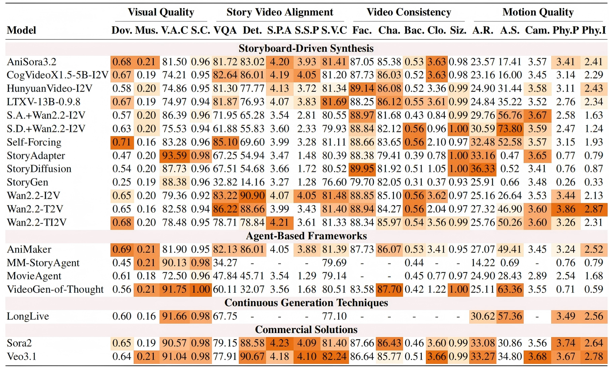

# [ACL 2026 Findings] <span style="color: orange">MSVBench</span>: Towards Human-Level Evaluation of Multi-Shot Video Generation

<!-- <a href="https://vistorybench.github.io/"></a> &ensp; -->
<a src="https://img.shields.io/badge/cs.MM-2602.23969-b31b1b?logo=arxiv&logoColor=red" href="https://arxiv.org/abs/2602.23969"> </a> 
<a href="https://huggingface.co/datasets/MrSunshy/MSVBench"></a> &ensp;
<!--  -->

## 🎏 Overview
### Dataset Construction


<p><b>MSVBench Dataset</b> adopts a hierarchical data construction paradigm that decomposes complex stories into global priors, scene-level segments, and shot-level conditions.</p>

### Evaluation Metrics


<p><b>MSVBench Evaluation Metrics</b> establishes an innovative hybrid evaluation framework that integrates the high-level semantic reasoning of Large Multimodal Models (LMMs) with the fine-grained perceptual rigor of domain-specific expert models.</p>

### Leaderboard


<p><b>MSVBench LeaderBoard</b> presents a thorough evaluation of 20 diverse video generation methods. </p>

## 🚩 Latest Updates
- [x] **[2025.04.16]** 🚀 Project launch and code release.
- [x] **[2026.04.06]** 🔥 ACL 2026 Findings accepted!
- [x] **[2025.02.27]** 📄 ArXiv v1 has been published.

## 🛠️ Setup

### Download
```bash
git clone --recursive https://github.com/MSVBench/MSVBench.git
cd MSVBench
```

Download required assets from HuggingFace: https://huggingface.co/datasets/MrSunshy/MSVBench

```bash
# 1) Download archives
wget https://huggingface.co/datasets/MrSunshy/MSVBench/resolve/main/Dataset.zip
wget https://huggingface.co/datasets/MrSunshy/MSVBench/resolve/main/ConsistencyEvalModels.zip

# 2) Place Dataset.zip contents into ./Dataset
unzip -o Dataset.zip -d Dataset

# 3) Place consistency model files into VideoConsistency output
unzip -o ConsistencyEvalModels.zip
cp -f cartooncharacter.pth Metrics/VideoConsistency/tools/Inceptionnext/output/
cp -f cartoonface.pth Metrics/VideoConsistency/tools/Inceptionnext/output/
cp -f model_best.pth Metrics/VideoConsistency/tools/Inceptionnext/output/
```

Expected model paths:
- `Metrics/VideoConsistency/tools/Inceptionnext/output/cartooncharacter.pth`
- `Metrics/VideoConsistency/tools/Inceptionnext/output/cartoonface.pth`
- `Metrics/VideoConsistency/tools/Inceptionnext/output/realcharacter.pth`

Note: Model deployment and download guidelines for submetrics can be found in Metrics/\*/checkpoints/instruction.txt and Metrics/\*/tools/instruction.txt.

### Environment
```bash
conda create -n MSVBench python=3.10
conda activate MSVBench
# for cuda 12.4
pip install pytorch==2.4.0 torchvision==0.19.0 torchaudio==2.4.0 pytorch-cuda=12.4 -c pytorch -c nvidia
pip install -r requirements.txt
```
Choose the torch version that suits you on this website:
https://pytorch.org/get-started/previous-versions/

## 🚀 Usage

### Data Preparation
1) Generate videos from `Dataset/script/<story_id>.json` and save to:

```bash
Evaluation/data/videos/<story_id>/*.mp4
```

2) Input lookup for `prompt/script/camera/characters`:
- Default: `Dataset/<type>/<story_id>.*`
- Custom override (higher priority): `Dataset/baselineinfo/<method>/<type>/<story_id>.*`

`<type>` includes `prompt`, `script`, `camera`, `characters`.

3) Video lookup:
- Default: `Evaluation/data/videos/<story_id>`
- Custom override (higher priority): `Dataset/baselineinfo/<method>/videos/<story_id>`

### Run Evaluation

```bash
bash MSVBench.sh
```

Useful options:

```bash
# skip cases that already have output json
SKIP_IF_EXISTS=1 bash MSVBench.sh

# run selected modules only
MODULES="visual_quality,story_alignment" bash MSVBench.sh

# run selected submetrics (format: module=sub1,sub2;module=sub1)
SUBMETRICS="story_alignment=blip_bleu_score,shot_perspective_alignment;motion_quality=action_recognition" bash MSVBench.sh
```

Run one single case directly:

```bash
METHOD=<method> STORY_ID="01" python3 MSVBench.py
```

### Output Structure
MSVBench evaluation results are saved under `Evaluation/results/` with one JSON file per `(method, story_id)` pair:

- `Evaluation/results`: Root directory for evaluation outputs.
- `method` folder: Method name, e.g., `LongLive`, `CogVideo`, `Wan2.2-i2v`.
- `story_id.json`: Evaluation result for one story (e.g., `01.json`, `27.json`).

Each JSON file typically contains:
- `evaluation_info`: metadata (`method`, `story_id`, `video_directory`, `evaluation_timestamp`, `modules_evaluated`).
- `timing_info`: runtime per module.
- Module outputs: `visual_quality`, `story_alignment`, `video_consistency`, `motion_quality`.

By default, `MSVBench.sh` writes results to:
- `Evaluation/results/<method>/<story_id>.json`


## 📚 Citation
```bibtex
@article{shi2026msvbench,
  title={MSVBench: Towards Human-Level Evaluation of Multi-Shot Video Generation},
  author={Shi, Haoyuan and Li, Yunxin and Deng, Nanhao and Xu, Zhenran and Chen, Xinyu and Wang, Longyue and Hu, Baotian and Zhang, Min},
  journal={arXiv preprint arXiv:2602.23969},
  year={2026}
}
```